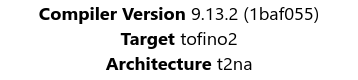
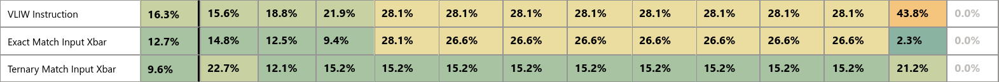
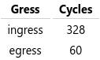
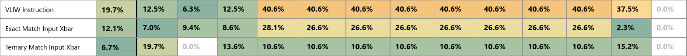
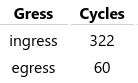
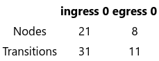

## Switch Pipeline Resources (Edgecore DCS810, 20-stage Tofino2)

> **NOTE** The software that produced the info below, including its artifacts, is still consindered confidential by Intel, and thus NDAs still apply. Therefore, we can only share what we know is safe to share. Should Intel relax these restrictions we will update this page accordingly. 

### Straggle-Aware

| Cycles | Parser info |
|:------:|:-----------:|
|  |  |

### Straggle-Oblivious (Standard INA like SwitchML etc.)

| Cycles | Parser info |
|:------:|:-----------:|
|  |  |